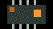

# Miao Chen 

浙江工业大学 · 杭州

把传感器接到一块板子上，再接到一个能做判断的系统上。

## 现在在做

<table>
<tr>
<td width="33%" valign="top">

### [手势识别](https://github.com/Einell/gesture-recognition-project)

摄像头认 14 种静态手势和 4 种动态手势。SVM 管静态，LSTM 管动作，结果直接变成对电脑的控制。

</td>
<td width="33%" valign="top">

### [电机故障诊断](https://github.com/Einell/Motor-Fault-Diagnosis-System)

三轴振动加上声音，走完采集、MQTT、特征和推理。六种电机状态，测试准确率 98.43%。

</td>
<td width="33%" valign="top">

### [STM32 温控](https://github.com/Einell/Temperature-Control-System-on-STM32F407)

STM32F407 上的闭环温度控制：感知、PID、界面，以及远程看数据。

</td>
</tr>
</table>

## 手里的工具 

 

<picture>
  <source media="(prefers-color-scheme: dark)" srcset="https://raw.githubusercontent.com/Einell/Einell/output/github-snake-dark.svg" />
  <source media="(prefers-color-scheme: light)" srcset="https://raw.githubusercontent.com/Einell/Einell/output/github-snake.svg" />
  
</picture>

---

浙江工业大学在读。近期还在 i.MX6ULL 上做姿态监测，并用 Rust 写过一个本地音乐播放器。

[个人站点仓库](https://github.com/Einell/Einell.github.io)

